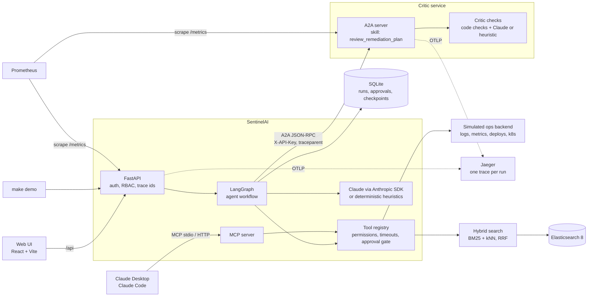
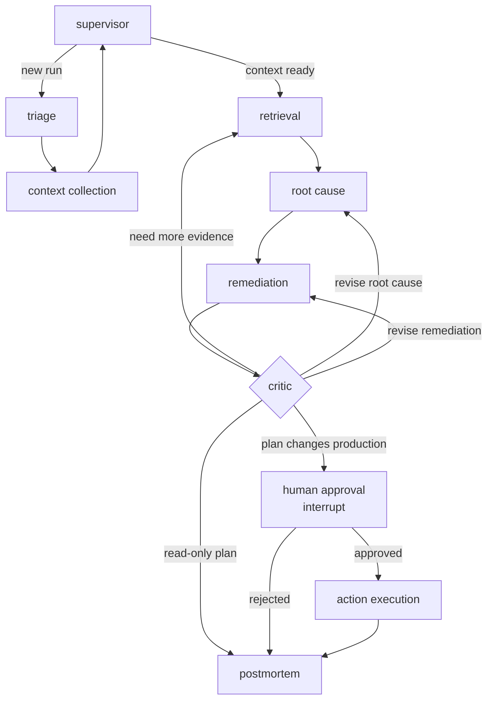

# SentinelAI

Multi-agent incident response for SRE teams. When an alert fires, a LangGraph workflow of
specialist agents pulls logs, metrics and deploy history, searches runbooks and past incidents
with hybrid retrieval on Elasticsearch, ranks root cause hypotheses against the evidence, and
proposes a remediation plan. Anything that changes production waits for a human with the right
role to approve it.

[](https://github.com/gagan-rohith/sentinel-ai/actions/workflows/lint.yml)
[](https://github.com/gagan-rohith/sentinel-ai/actions/workflows/test.yml)
[](https://github.com/gagan-rohith/sentinel-ai/actions/workflows/docker.yml)
[](LICENSE)

**Live demo:** https://gagan-rohith.github.io/sentinel-ai/ (a replay of recorded runs, see below)

**New here?** [SentinelAI, explained simply](docs/INTRODUCTION.md) walks through the idea in plain language.

**Demo video:** _coming soon_


## Contents

- [What it does](#what-it-does)
- [Architecture](#architecture)
- [Quick start](#quick-start)
- [Local development](#local-development)
- [API usage](#api-usage)
- [MCP server](#mcp-server)
- [Evaluation](#evaluation)
- [Security model](#security-model)
- [Observability and deployment](#observability-and-deployment)
- [Limitations](#limitations)
- [Future improvements](#future-improvements)
- [Project layout](#project-layout)

## What it does

The demo incident, INC-1060: `checkout-api` in production starts returning 500s and 503s during
a flash sale. Traffic is about 2.5x normal, p99 latency is 4.7 seconds, and there was a deploy
three hours earlier, which is the obvious suspect.

1. **Triage** classifies it as a sev1 database problem.
2. **Context collection** calls the ops tools in parallel: service health, error logs, metric
   anomalies, deployments and recent changes. The logs show
   `HikariPool-1 - Connection is not available` and a pool at `total=100, active=100, idle=0, waiting=412`.
3. **Retrieval** searches runbooks, similar past incidents and service docs.
4. **Root cause** ranks hypotheses. PostgreSQL connection pool exhaustion wins, with evidence
   cited by id. The deploy is **ruled out**: errors did not start within 30 minutes of it.
5. **Remediation** turns the matching runbook into steps: confirm saturation, shed traffic,
   add PgBouncer, and a rolling restart of `checkout-api`.
6. **Critic** checks that every cited evidence id exists, that the chosen hypothesis is not
   contradicted by its own evidence, and that every tool call is valid. It can send work back
   up to three times.
7. **Human approval.** The restart changes production, so the run pauses. An operator key is
   refused with 403; an admin approves.
8. **Execution and postmortem.** The restart runs (against a simulated cluster) and the
   postmortem is written with a timeline built from real timestamps.

| Approval gate | Report |
|---|---|
|  |  |

The [live demo](https://gagan-rohith.github.io/sentinel-ai/) is this web UI built in replay
mode: every run, approval request and report on it was produced by the real system with
`make record-demo` and is played back in the browser, so it needs no server. To run the system
itself in a terminal without any setup beyond Python: `make demo ARGS=--memory`. The
[demo guide](docs/DEMO.md) covers the web UI, the terminal and Claude Desktop.

## Architecture



The tool registry is the only place tools are called from, by the agents, the REST API and
the MCP server alike, so permission checks and the approval gate cannot be bypassed. The
critic, which reviews every plan before it reaches a human, runs as a separate A2A service
(see [A2A design](#a2a-design)).

### Agent workflow



- **Evidence catalog.** Everything collected becomes an evidence item with an id (`E1`, `E2`,
  ...). Agents cite ids, so grounding is checked in code rather than by asking a model.
- **Safety facts come from code.** Whether an action is destructive comes from the tool
  registry, never from the model.
- **Pause and resume.** Approval uses LangGraph `interrupt()` with a SQLite checkpointer, so a
  paused run survives an API restart.
- **Two modes.** With `ANTHROPIC_API_KEY` set, agents use Claude with structured outputs. Without
  it they use deterministic heuristics over the same evidence, so the whole system runs offline.
  If a Claude call fails mid-run, that step falls back and the report says so.

Design decisions and trade-offs are in [ARCHITECTURE.md](ARCHITECTURE.md).

### A2A design

The critic is the one agent whose job is to doubt the others: it checks that a plan's
evidence ids exist, that the chosen root cause is not contradicted by its own evidence, and
that every proposed action is valid, and it can send work back. It runs as a standalone
service that the orchestrator calls over the [Agent2Agent protocol](https://a2a-protocol.org)
(`a2a-sdk` 1.x, spec 1.0).

**Why split it out.**

- **Independent review.** The reviewer runs apart from the planner, in its own process,
  with its own configuration. It can use a different model from the agents it reviews, and
  it holds no tool permissions or API keys, only the hash of the key callers must present.
- **A standard boundary.** Any A2A client can call it and any A2A agent can replace it: a
  critic written in another framework, run by another team, or using another model, as long
  as it offers the `review_remediation_plan` skill.
- **Independent scaling.** Reviews are stateless, so the critic runs several replicas in
  Kubernetes while the orchestrator stays at one (its SQLite state allows only one).

**How the hop works.**

1. The orchestrator reads the critic's Agent Card (`/.well-known/agent-card.json`), which
   advertises the skill, the JSON-RPC endpoint and the API-key scheme.
2. It sends the plan with the evidence it cites as a JSON data part. Both sides validate it
   with the same Pydantic models.
3. The critic runs the same checks as the in-process critic and returns
   `{approved, reasons, risk_level}` plus the detailed verdict, so retry routing is unchanged.
4. If the critic is down, times out, rejects the request or returns something malformed, the
   plan counts as not approved: no retries, the reason goes into the report, and the run goes
   to a human, even when the plan changes nothing in production.

The key pair comes from `python -m critic_service.keys`: the orchestrator holds the key, the
critic only its SHA-256 hash, and the SDK's auth interceptor sends it as the card asks. A W3C
`traceparent` header carries the trace across, so one OpenTelemetry trace, with the run's
SentinelAI trace id, spans both services.

**Trade-offs.** The hop adds a network call and a failure mode the in-process critic does not
have, which is why failures fall back to human review. `CRITIC_MODE=local` keeps the critic
in-process, and the tests, the benchmark and `make demo` use it by default; Docker Compose and
Kubernetes run it as a service.

### Tech stack

| Area | Choice |
|---|---|
| API | Python 3.11, FastAPI, Pydantic v2, structlog |
| Agents | LangGraph 1.x, Anthropic SDK (Claude), deterministic fallback |
| Retrieval | Elasticsearch 8.15, BM25 + dense vectors (all-MiniLM-L6-v2, 384 dims), reciprocal rank fusion |
| Storage | SQLite (aiosqlite) for incidents, runs, approvals and graph checkpoints |
| Tool protocol | MCP Python SDK, stdio and streamable HTTP |
| Agent protocol | A2A (`a2a-sdk` 1.x, spec 1.0) over JSON-RPC, for the critic service |
| Frontend | React 19, TypeScript, Vite |
| Observability | Prometheus metrics, OpenTelemetry traces (Jaeger), trace ids, optional LangSmith |
| Delivery | Docker Compose, Kubernetes manifests, Terraform (AWS ECS Fargate), GitHub Actions |

## Quick start

Needs Docker Desktop and Python 3.11 (only to generate keys).

```bash
git clone https://github.com/gagan-rohith/sentinel-ai.git
cd sentinel-ai
cp .env.example .env
python -m auth.api_keys operator     # prints a key and a config line
python -m auth.api_keys admin
python -m critic_service.keys        # key pair for the critic service
```

Put both `config:` lines in `API_KEYS` in `.env`, comma separated
(`API_KEYS=operator:<hash>,admin:<hash>`), and keep the two `key:` values somewhere safe; only
their hashes are stored. Copy the two `CRITIC_API_KEY...` lines into `.env` as printed. Then:

```bash
docker compose --profile frontend up --build
```

The first build takes several minutes (CPU PyTorch and the embedding model are baked into the
image). Elasticsearch and the critic service start, a one-off job builds the search index,
then the API starts.

- Web UI: http://localhost:3000 (paste the operator key; switch to the admin key to approve)
- API docs: http://localhost:8000/docs

## Local development

```bash
python -m venv .venv
.venv\Scripts\activate                # Windows; on macOS or Linux: source .venv/bin/activate
pip install torch --index-url https://download.pytorch.org/whl/cpu
pip install -e ".[dev,ml]"

docker compose up -d elasticsearch     # or set SEARCH_BACKEND=memory in .env
make index                             # build the search index if it is stale
make run                               # API on :8000 with reload

cd frontend && npm ci && npm run dev   # UI on :5173, proxies /api to :8000
```

| Command | What it does |
|---|---|
| `make check` | ruff, mypy (strict) and the test suite with coverage |
| `make demo` | terminal walkthrough of INC-1060 (`ARGS=--memory` for no Docker) |
| `make bench` | run the benchmark and write `evals/reports/latest.{json,md}` |
| `make data` | regenerate the synthetic incidents, logs, metrics and runbooks |

Without `make`, run the command it wraps, for example `python -m app.demo --memory`.

Tests use an in-memory search backend and a hash embedder, so they need neither Docker nor
model downloads. CI also runs them against a real Elasticsearch service.

## API usage

Every request except `/health` needs an `X-API-Key` header.

```bash
KEY=<operator key>; ADMIN=<admin key>

# Start an analysis
curl -X POST -H "X-API-Key: $KEY" localhost:8000/agents/analyze/INC-1060
# {"run_id": "run-4f1c...", "status": "queued", ...}

# Poll until it completes or pauses
curl -H "X-API-Key: $KEY" localhost:8000/agents/status/run-4f1c...

# See what it wants to do
curl -H "X-API-Key: $KEY" localhost:8000/agents/run-4f1c.../approval

# Approve (admin) or reject (operator, reason required)
curl -X POST -H "X-API-Key: $ADMIN" -H "Content-Type: application/json" \
  -d '{"comment": "pool saturation confirmed"}' localhost:8000/agents/run-4f1c.../approve
curl -X POST -H "X-API-Key: $KEY" -H "Content-Type: application/json" \
  -d '{"reason": "restart during peak is too risky"}' localhost:8000/agents/run-4f1c.../reject

# Full report: evidence, hypotheses, plan, executed actions, postmortem
curl -H "X-API-Key: $KEY" localhost:8000/agents/run-4f1c.../report
```

| Endpoint | Purpose |
|---|---|
| `GET /incidents`, `GET /incidents/{id}`, `POST /incidents` | Incident records |
| `POST /agents/analyze/{id}` | Start a run |
| `GET /agents/runs`, `GET /agents/status/{run_id}` | Run list and status |
| `GET /agents/{run_id}/approval`, `POST .../approve`, `POST .../reject` | Human approval |
| `GET /agents/{run_id}/report` | Final report |
| `GET /tools/logs/{service}`, `/tools/metrics/{service}`, `/tools/deployments/{service}`, `/tools/search` | Direct tool access |
| `GET /evals/latest`, `POST /evals/run` | Benchmark results |
| `GET /health`, `GET /metrics` | Health and Prometheus metrics |

Errors share one shape, `{"error": {"code", "message", "details", "trace_id"}}`, and every
response carries an `X-Trace-Id` header that also appears in the logs.

## MCP server

The same tools are available to Claude Desktop, Claude Code or any MCP client:

```bash
python -m mcp_server.server                                          # stdio
python -m mcp_server.server --transport streamable-http --port 8765  # HTTP
```

Nine tools: log search, metrics, service health, runbook search, similar incident search,
deployment status, ticket creation, and the two production-changing tools, `restart_service`
and `rollback_deployment`. Those two need an admin key **and** an approval id from the human
approval workflow, so an assistant can investigate freely but cannot change production on its
own. Setup for Claude Desktop and Claude Code is in [docs/MCP.md](docs/MCP.md).

## Evaluation

`make bench` runs the benchmark and writes `evals/reports/latest.json` and `latest.md`.
`python -m evals.benchmark --provider anthropic --out evals/reports/claude` runs the same
benchmark with Claude doing the agents' reasoning.

**Dataset.** 60 synthetic incidents: 20 failure types (connection pool exhaustion, OOM kills,
expired TLS certificates, bad deploys, Kafka lag, and so on), 3 variants each, with logs,
metrics, deploy history, ground truth root cause and the relevant runbooks. Plus 42 paraphrased
questions, written to avoid the runbooks' own wording, for testing retrieval.

**Two agent settings.**

- **Standard:** the incident under test is hidden from similar-incident search, but its two
  sibling variants are not.
- **Holdout:** every past incident with the same failure type is hidden too, so the agents
  cannot copy a matching precedent and have to reason from runbooks and telemetry. This is the
  more honest measure.

**Results.** Retrieval and the heuristic agents are from
[evals/reports/latest.md](evals/reports/latest.md) (commit `d8d68bb`); the Claude agents are
from [evals/reports/claude/latest.md](evals/reports/claude/latest.md) (commit `26924f0`,
`claude-sonnet-5-5` at its default effort, 2026-10-06). Both use Elasticsearch with
all-MiniLM-L6-v2, 60 incidents and 42 questions.

| Retrieval on paraphrased questions | Recall@1 | Recall@3 | MRR |
|---|---|---|---|
| BM25 | 71.4% | 91.7% | 0.818 |
| Vector | 79.8% | 97.6% | 0.885 |
| Hybrid (RRF) | **91.7%** | 96.4% | **0.952** |

| Agents | Heuristic, standard | Claude, standard | Heuristic, holdout | Claude, holdout |
|---|---|---|---|---|
| Correct runbook chosen as root cause | 100.0% | 100.0% | 41.7% | **90.0%** |
| Root cause matches the ground truth in meaning | 100.0% | 100.0% | 0.0% | 100.0% |
| Citation validity (cited ids that exist) | 100.0% | 100.0% | 100.0% | 100.0% |
| Unsupported claim rate | 0.0% | 2.2% | 0.0% | 1.9% |
| Brier score (lower is better) | 0.127 | 0.014 | 0.253 | 0.102 |
| Runs where the critic sent work back | 0.0% | 45.0% | 20.0% | 41.7% |
| Plans that needed human approval | 20.0% | 55.0% | 25.0% | 53.3% |
| Mean time per incident | 164 ms | 72 s | 204 ms | 74 s |
| Cost of the 60 runs | $0 | $8.34 | $0 | $8.58 |

How to read this:

- Hybrid retrieval puts the right runbook first far more often than either method alone
  (91.7% vs 71.4% and 79.8%), which is what the agents consume.
- Standard accuracy is 100% for both because a sibling incident with the same root cause is
  always in the index. Holdout, with every precedent hidden, is the real measure of reasoning.
- **On failure types it has never seen, Claude picks the right runbook 90% of the time against
  41.7% for the heuristic agents.** It fixed 29 of the heuristics' 35 holdout misses and broke
  none of their hits.
- Claude's six holdout misses are correct diagnoses that the strict metric does not count: the
  explanation matches the ground truth (hence 100% semantic match), but the chosen hypothesis
  does not cite the runbook evidence the metric requires. The strict number is kept as the
  headline because it is the same rule the heuristic numbers use.
- Claude is much better calibrated (Brier 0.014 and 0.102 against 0.127 and 0.253).
- The costs: about 2% unsupported claims against none, the critic sends work back far more
  often, each incident takes about a minute and about 14 cents, and plans propose
  production-changing actions more often, so about half of them wait for human approval.
- The dataset is synthetic and small. Treat the numbers as a regression baseline, not as
  evidence of production performance.

## Security model

- **API keys with roles.** `viewer` reads, `operator` analyzes and rejects, `admin` also
  approves production changes. Only SHA-256 hashes of keys are stored.
- **No automatic destructive actions.** A production-changing step always pauses the run.
  Approval needs the admin role, is single use, and only the exact actions in the approved
  plan can run.
- **One enforcement point.** REST, agents and MCP all call tools through the registry, which
  checks permissions, validates inputs and outputs, and applies timeouts.
- **Grounding checks in code.** The critic rejects evidence ids that do not exist, so a
  hallucinated citation cannot reach the report unnoticed.
- **Secrets stay out of the repo.** `.env` is ignored, Kubernetes takes credentials from a
  Secret created at deploy time, and the Terraform stack creates the secret without a value,
  so none lands in state.

## Observability and deployment

- Structured JSON logs with a trace id per request, carried into the agent run.
- Prometheus metrics at `/metrics`: request rates and latency, tool and agent calls and
  latency, runs by outcome, critic retries, approval decisions, and LLM tokens and cost. `docker compose --profile observability up` adds Prometheus.
- OpenTelemetry traces: one trace per run spans the API and the critic service, with the run's
  trace id. `docker compose --profile observability up` adds Jaeger on :16686; set
  `OTEL_EXPORTER_OTLP_ENDPOINT=http://jaeger:4318` in `.env` to send traces to it.
- LangSmith tracing turns on only when `LANGSMITH_API_KEY` is set.
- Docker images run as non-root with the embedding model baked in. Kubernetes manifests in
  `k8s/` and an AWS ECS Fargate stack in `terraform/` (validated and planned, never applied).
  Details in [docs/DEPLOYMENT.md](docs/DEPLOYMENT.md).
- CI runs lint (ruff, mypy strict, terraform, kubeconform), the test suite against a real
  Elasticsearch with an 80% coverage floor, and Docker builds.

## Limitations

- **Simulated operations.** Logs, metrics, deployments and the Kubernetes actions come from a
  seeded simulator, not a real cluster.
- **Synthetic data.** 60 generated incidents are enough to compare methods, not to predict
  real-world accuracy.
- **Claude was benchmarked once,** on one model at its default effort. Other models and effort
  levels are not measured. See [Evaluation](#evaluation).
- **Single API process.** Runs, approvals and checkpoints are in SQLite, so one API instance
  per database. Scaling out means moving to PostgreSQL.
- **Local Elasticsearch runs with security off.** The Compose setup is for local use only.
- The web UI polls for progress instead of streaming it.

## Future improvements

- Compare Claude models and effort levels, and make the strict runbook metric credit a correct
  diagnosis that does not cite the runbook.
- Connectors for real telemetry: Prometheus queries, Loki or Elasticsearch logs, Kubernetes.
- PostgreSQL for app state and LangGraph checkpoints, to run several API replicas.
- Stream agent progress to the UI with server-sent events.
- Slack or PagerDuty integration for approvals.
- A larger, less templated incident dataset, ideally including real anonymized postmortems.

## Project layout

```
agents/          agent nodes, prompts, heuristics, evidence catalog
app/             FastAPI app, routes, dependency container, terminal demo
auth/            API keys, roles, permissions, JWT validation
core/            domain models, enums, typed errors
critic_service/  the critic as an A2A service, and the orchestrator's client for it
data/            synthetic data generator, incidents, logs, runbooks
evals/           benchmark, evaluators, datasets, reports
graph/           LangGraph state, routing, checkpointer, run manager
mcp_server/      MCP server over the tool registry
observability/   logging, metrics, tracing
retrieval/       Elasticsearch and in-memory backends, embeddings, hybrid search
storage/         SQLite repositories
tools/           ops tools and the tool registry
frontend/        React web UI
docker/ k8s/ terraform/ .github/   deployment and CI
docs/            deployment, MCP and demo guide
```

## License

[MIT](LICENSE), copyright (c) 2026 Gagan Rohit.
